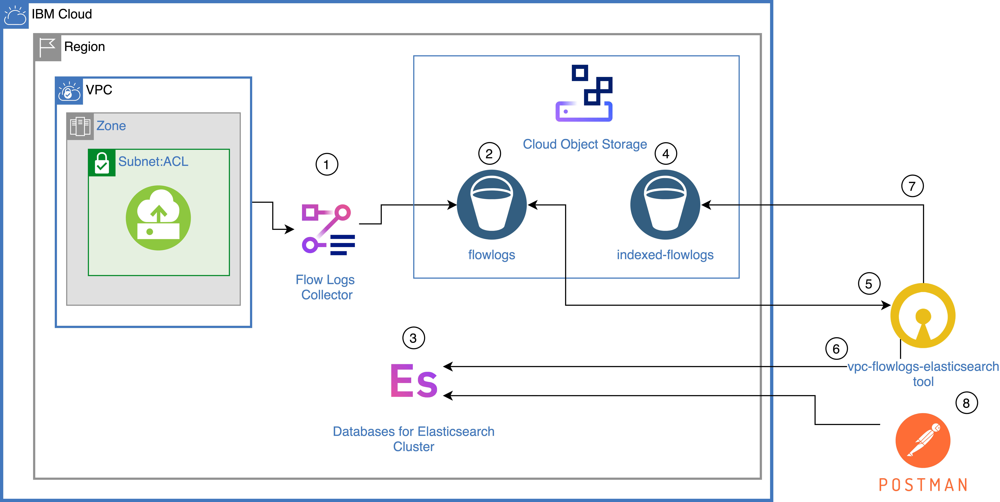

# VPC Flow Logs Indexer with Databases for Elasticsearch

The `vpc-flowlogs-elasticsearch` command line tool ("the tool"), lets you read your [VPC Flow Logs](https://cloud.ibm.com/docs/vpc?topic=vpc-flow-logs) from a Cloud Object Storage (COS) Bucket and index them to an Elasticsearch cluster running in the IBM Cloud. The tool also includes a basic search/results capability.  

  

This repository assumes that you have an existing VPC that is configured with a Flow Logs collector(1) to write to a COS bucket(2). The tool requires: 
  - a second bucket(5) to be created within the same COS instance to store all flow logs that have previously been indexed,
  - a Database for Elasticsearch instance to exist (can be any IBM Cloud region).

When executed the tool will: 
  - read(3) all flow logs objects from the flow logs bucket(2), 
  - index to Elasticsearch(6),
  - delete the indexed objects from the flow logs bucket(2) and write them to he indexed flow logs bucket(5),
  - once indexed in Elasticsearch the tool can be used to query Elasticsearch or another tool such as Postman can also be used.


## Costs and Requirements

You must have a Pay-as-You-Go account in IBM Cloud&trade; to follow the steps in this repository to create resources. Since the costs for these resources will vary, use the [Cost Estimator](https://cloud.ibm.com/estimator/review) to generate a cost estimate based on your projected usage.

In addition to having an existing VPC in IBM Cloud and configured VPC Flow Logs, this project requires the provisioning of an instance of Databases for Elasticsearch. Make sure to delete services when they are no longer required in order to not incur charges in your account.

- [Account with IBM Cloud](https://cloud.ibm.com)
- [Existing VPC](https://cloud.ibm.com/vpc-ext/overview)
- [VPC Flow Logs already configured to write to a COS Bucket](https://cloud.ibm.com/vpc-ext/network/flowLogs)
-	[IBM Cloud Databases for Elasticsearch](https://cloud.ibm.com/catalog/services/databases-for-elasticsearch) version 6.8
  - The Elasticsearch client is specific to version 6.x

- Install the following tools as needed: 
  - [IBM Cloud CLI](https://cloud.ibm.com/docs/cli?topic=cloud-cli-install-ibmcloud-cli) (If you prefer the command line over using the web console)
  -	[Go](https://golang.org/doc/install) version 1.15.x (If you choose to build the tool from source)
  -	[Docker](https://docs.docker.com/get-docker/) (If you choose to build the tool from source but don't want to install GO)


## Install from releases binary

You can install the binary from source [here](https://github.com/dprosper/vpc-flowlogs-elasticsearch/releases)


## Build and install from source

1. Clone this repository to your local computer.

  ```sh
  git clone git@github.com:dprosper/vpc-flowlogs-elasticsearch.git
  ```

2. Build from your local machine
  ```sh
  go build
  ```
  
  Build using Docker for target OS:

  Mac OS
  ```sh
  docker run --rm -v "$PWD":/usr/src/vpc-flowlogs-elasticsearch -w /usr/src/vpc-flowlogs-elasticsearch -e GOOS=darwin -e GOARCH=amd64 golang:latest go build -v
  ```

  Linux
  ```sh
  docker run --rm -v "$PWD":/usr/src/vpc-flowlogs-elasticsearch -w /usr/src/vpc-flowlogs-elasticsearch -e GOOS=linux -e GOARCH=amd64 golang:latest go build -v
  ```

  Windows
  ```sh
  docker run --rm -v "$PWD":/usr/src/vpc-flowlogs-elasticsearch -w /usr/src/vpc-flowlogs-elasticsearch -e GOOS=windows -e GOARCH=amd64 golang:latest go build -v
  ```

## Provision a Databases for Elasticsearch instance

Create the Elasticsearch cluster.

#### IBM Cloud Web Console
  1. Use the IBM Cloud Console to create a new instance of [Databases for Elasticsearch instance](https://cloud.ibm.com/catalog/services/databases-for-elasticsearch).
  
  2. [Create Service Credentials](https://cloud.ibm.com/docs/databases-for-elasticsearch?topic=databases-for-elasticsearch-connection-strings#creating-users-from-_service-credentials_) which will be required to update the `flowlogs.json` file.

#### IBM Cloud CLI 
1. Create an instance of [Databases for Elasticsearch instance](https://cloud.ibm.com/catalog/services/databases-for-elasticsearch) using a **standard** plan. Replace **<region_name>** accordingly.
    ```sh
    ibmcloud resource service-instance-create flowlogs-es databases-for-elasticsearch databases-for-elasticsearch-standard <region_name>
    ```

    The service will take a few minutes to provision. You can get updates on the status by issuing the following command periodically
    ```sh
    ibmcloud resource service-instance flowlogs-es
    ```

2. Once you have verified the service status changed to "create succeeded", you may proceed to create a service key:
    ```sh
    ibmcloud resource service-key-create flowlogs-es-key --instance-name flowlogs-es
    ```

3. Obtain the service key details in JSON format and use the information provided to populate the relevant values for `elasticsearch` in the **flowlogs.json**.
    ```sh
    ibmcloud resource service-key flowlogs-es-key --output json
    ```

## Create a bucket for storing indexed logs

The tool will index all logs found in the COS bucket that is used for your VPC Flow Logs, as each log is indexed it is deleted and moved to another bucket, you need to provide a destination bucket for all the Flow Logs that have already been indexed. It needs to exist in the same instance as the bucket used by the Flow Logs you intend on indexing. 


## How to use:

### Configuring

1. Copy the `config/flowlogs.json` to your the `$HOME` directory of the current user. 
2. Edit the `~./flowlogs.json` file and replace all instances of `<provide_value>` with the relevant values for COS and Elasticsearch captured above.
 
 > You can place the `flowlogs.json` file in any directory of your choice and pass the `--config` flag with the location of the file to any of the commands below.

### Indexing

1. Index your existing flow logs by issuing the following command: 
    ```sh
    ./vpc-flowlogs-elasticsearch index
    ```

    > Add a `--trace` if you want to see the POST and response body from each index request to Elasticsearch.

2. The tool indexes 25 flow logs at a time. The indexing process may take a while based on the number of flow logs in the COS bucket. You can view the status of the indexing process by viewing the `system.log` under the `logs` directory. Errors are in the `error.log`.

### Searching

#### Using the tool
1. The `config/queries.json` file contains a few example queries: 
  - "top_25_target_ips", 
  - "top_10_initiator_ips", 
  - "total_direction_by_outbound_inbound",
  - "output_ommitted_es_response_body_used",
  - "14_days_top_5_rejected_by_target_ip",
  - "14_days_top_10_rejected_by_initiator_ip".
  
  The output is a JSON array.

```sh
  ./vpc-flowlogs-elasticsearch search --query 14_days_top_5_rejected_by_target_ip
```

> Add a `--trace` if you want to see the POST and response body from each index request to Elasticsearch.

#### Using [Postman](https://www.postman.com/downloads/) or similar client
  1. Review the [`config/sample_queries.md`](config/sample_queries.md) for example Elasticsearch endpoints and queries. 


## Issues

Please open *issues* here: [New Issue](https://github.com/dprosper/vpc-flowlogs-elasticsearch/issues)

## Related Content

- [Use IBM Log Analysis with LogDNA to Analyze VPC Network Traffic from IBM Cloud Flow Logs for VPC](https://www.ibm.com/cloud/blog/use-ibm-log-analysis-with-logdna-to-analyze-vpc-network-traffic-from-ibm-cloud-flow-logs-for-vpc)
- [vpc-flowlogs-logdna repository](https://github.com/IBM-Cloud/vpc-flowlogs-logdna)

## License

See [License](LICENSE) for license information.